

  <picture style="display: block; margin: 0 auto; width: 25%;">
    <source media="(prefers-color-scheme: dark)" srcset="https://github.com/Ph-ill/Capwise/blob/master/frontend/src/assets/Logo_Light.png">
    <source media="(prefers-color-scheme: light)" srcset="https://github.com/Ph-ill/Capwise/blob/master/frontend/src/assets/Logo.png">
    
  </picture>

<h1 align="center">Capwise</h1>

Capwise is a web application designed to help users discover movies they'll love. By swiping through movie suggestions, users provide feedback that helps the application build a personalized taste profile. This profile is then used to power intelligent movie recommendations, leveraging Google's Gemini API for advanced suggestions.

## Features

*   **Interactive Movie Discovery:** Swipe left/right to like/dislike, up/down for strong like/dislike.
*   **Watchlist:** Save movies to a personal watchlist for later viewing.
*   **"Not Interested" Marking:** Mark movies to avoid future suggestions.
*   **Personalized Recommendations:** Powered by Google's Gemini API, the app learns your preferences and suggests movies you're likely to enjoy.
*   **Taste Infographic:** A fun, animated visualization of your unique movie taste profile.
*   **API Key Management:** Securely store your Gemini API key for personalized recommendations.

## Technologies

*   **Frontend:** React, Material-UI/Bootstrap, Framer Motion
*   **Backend:** Node.js, Express.js
*   **Database:** NeDB
*   **APIs:** Google Gemini API, The Movie Database (TMDB) API

## Getting Started

Further instructions on setting up the frontend and backend will be provided in their respective `README.md` files.

## Screenshots

Here are some screenshots of the application in action. Click on a thumbnail to view the full-sized image.

### Main Page (with various themes)
[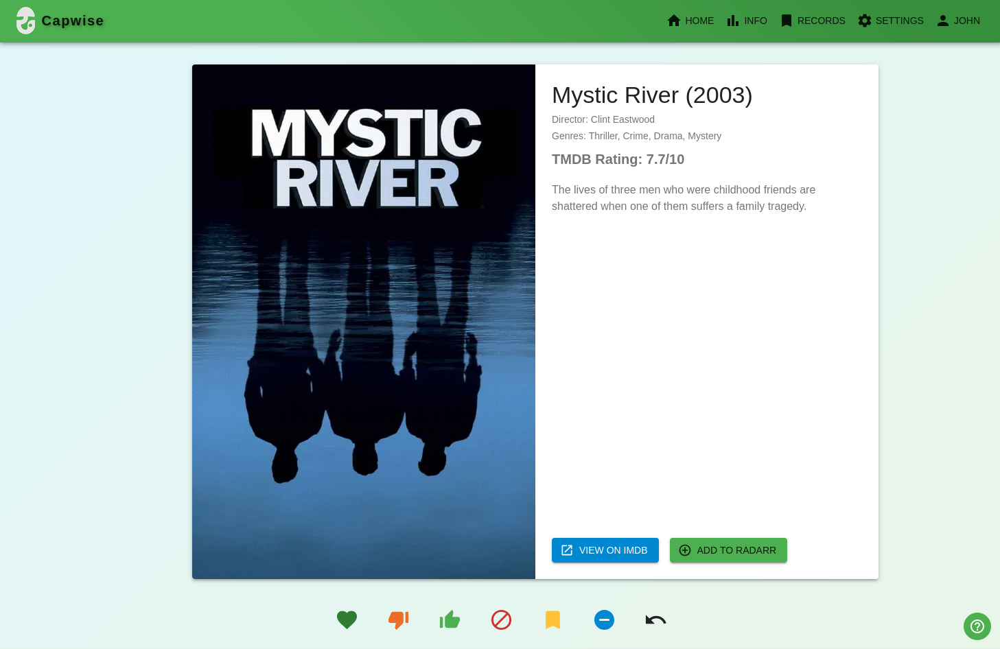](Images/Main_Page.png)
[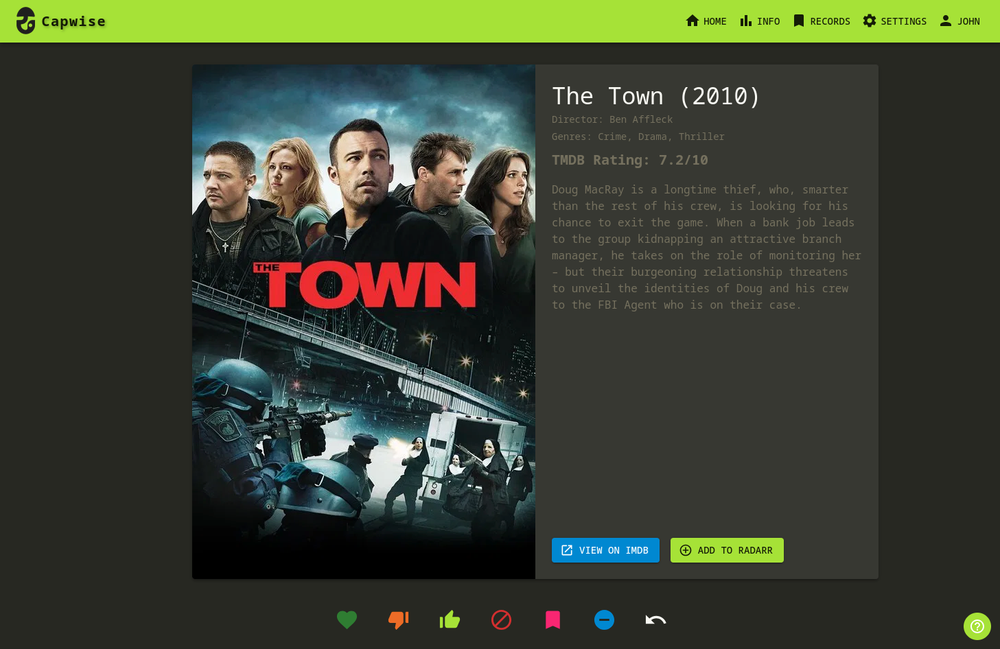](https://github.com/Ph-ill/Capwise/blob/master/Images/Main_Page.png?raw=true))
[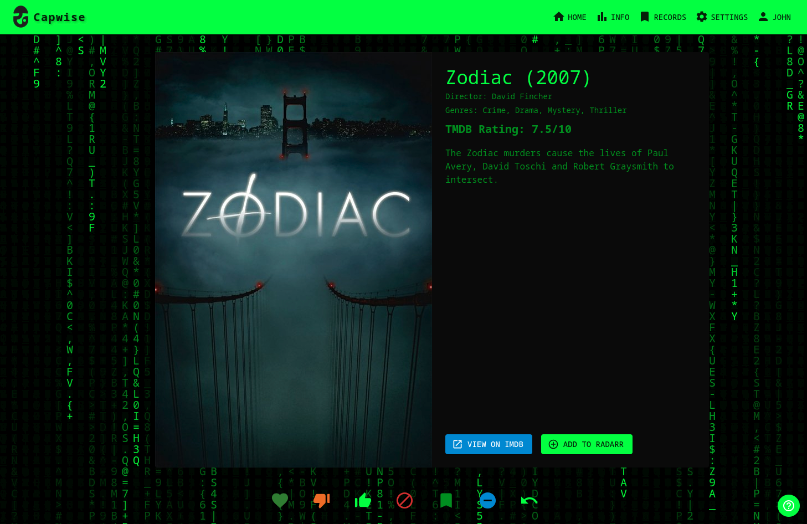](https://github.com/Ph-ill/Capwise/blob/master/Images/Main_Page_Theme_2.png?raw=true)
[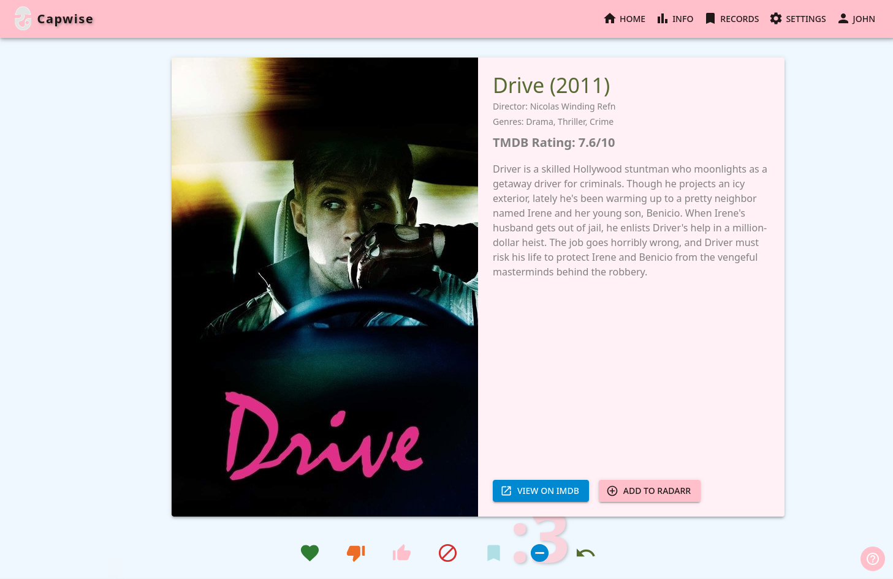](https://github.com/Ph-ill/Capwise/blob/master/Images/Main_Page_Theme_3.png?raw=true)
[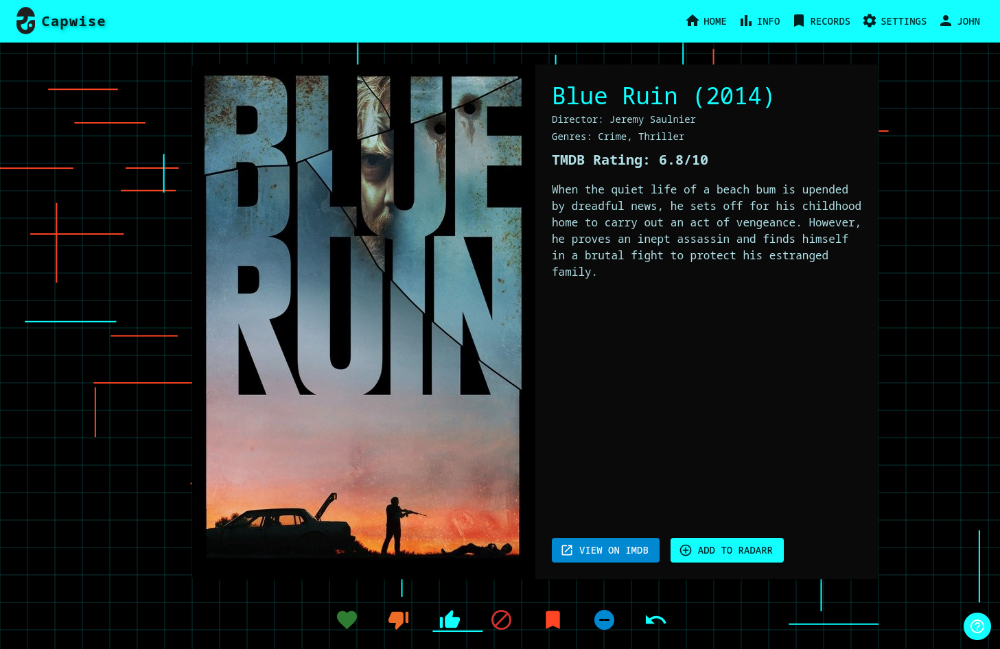](https://github.com/Ph-ill/Capwise/blob/master/Images/Main_Page_Theme_4.png?raw=true)

### Information Pages
[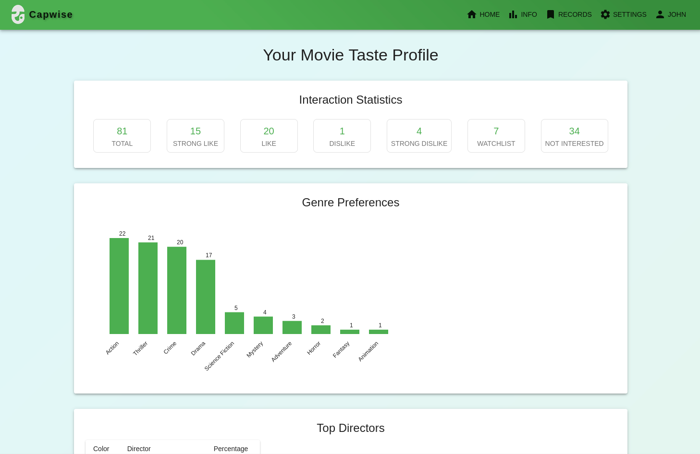](https://github.com/Ph-ill/Capwise/blob/master/Images/Info_Page_1.png?raw=true)
[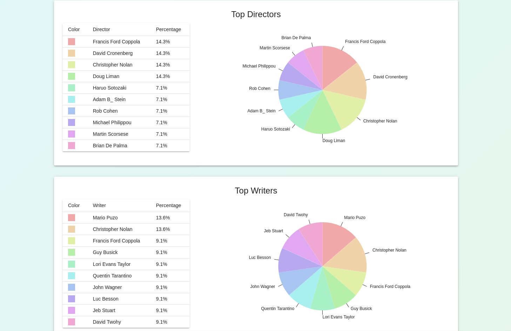](https://github.com/Ph-ill/Capwise/blob/master/Images/Info_Page_2.png?raw=true)
[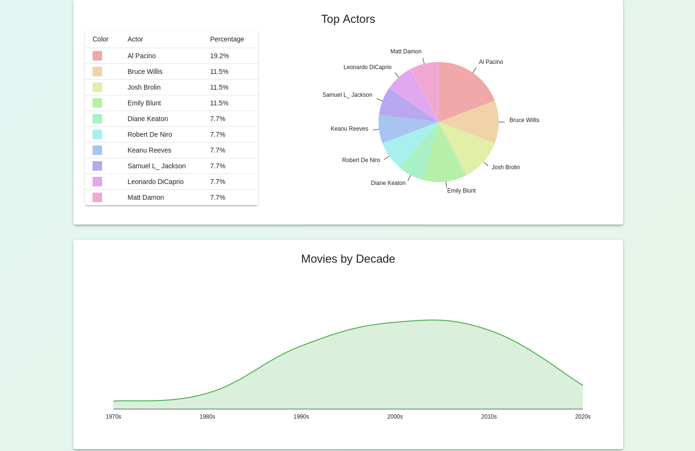](https://github.com/Ph-ill/Capwise/blob/master/Images/Info_Page_3.png?raw=true)

### Profile and Settings
[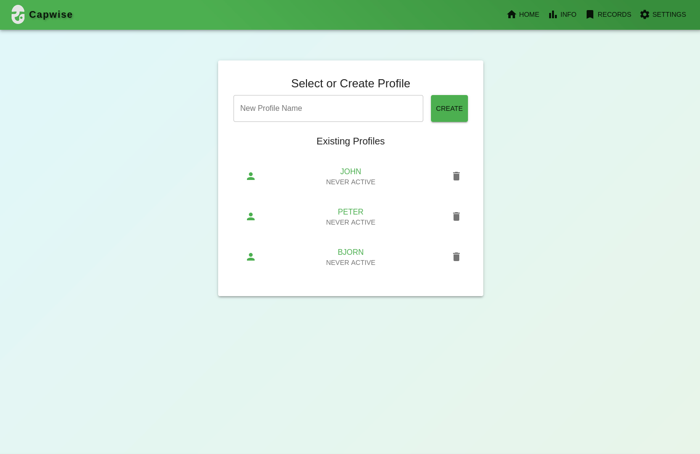](https://github.com/Ph-ill/Capwise/blob/master/Images/Profile_Page.png?raw=true)
[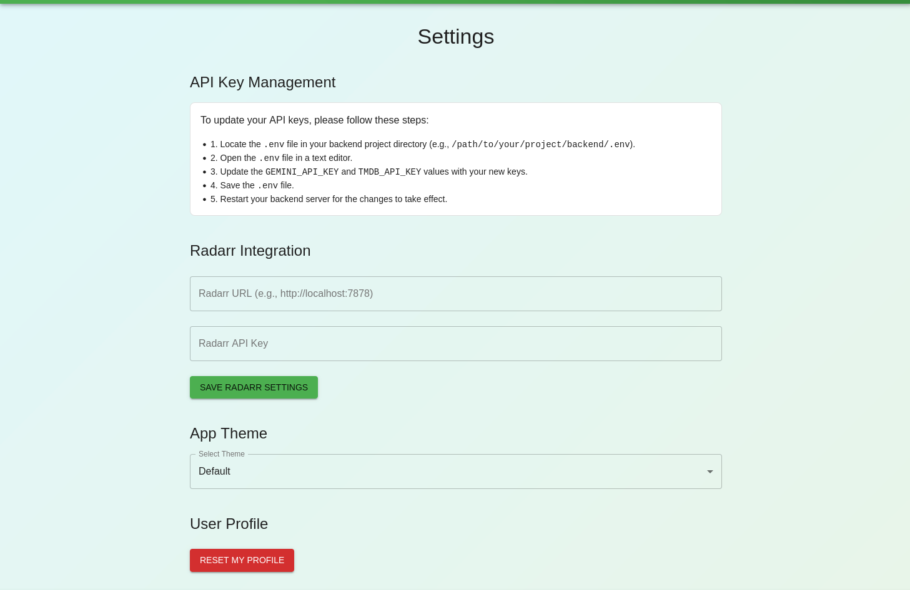](https://github.com/Ph-ill/Capwise/blob/master/Images/Settings_Page.png?raw=true)

### Records Page
[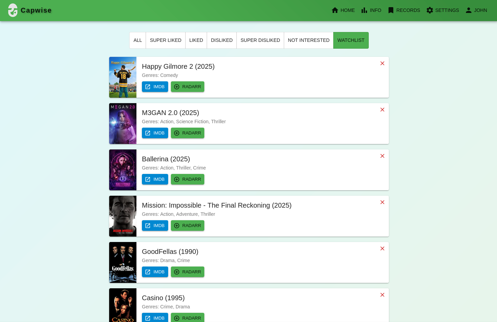](https://github.com/Ph-ill/Capwise/blob/master/Images/Records_Page.png?raw=true)
